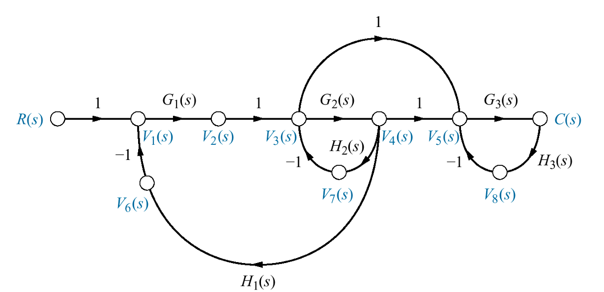

# Diagrama-de-Fluxo

## Sinais 
#### 10 sinais

## Input
#### R>V1, V1>V2, V2>V3, V3>V4, V4>V5, V5>C, V3>V5, V4>V7, V7>V3, V4>V6, V6>V1, C>V8, V8>V5

## Caminhos a Frente
#### 1. R>V1, V1>V2, V2>V3, V3>V4, V4>V5, V5>C
#### 2. R>V1, V1>V2, V2>V3, V3>V5, V5>C

## Ganhos de Laço
#### 1. V1>V2, V2>V3, V3>V4, V4>V6, V6>V1
#### 2. V3>V4, V4>V7, V7>V3
#### 3. V5>C, C>V8, V8>V5

## Ganhos de Laços que não se tocam (2X2)
#### 1 e 3
#### 2 e 3
